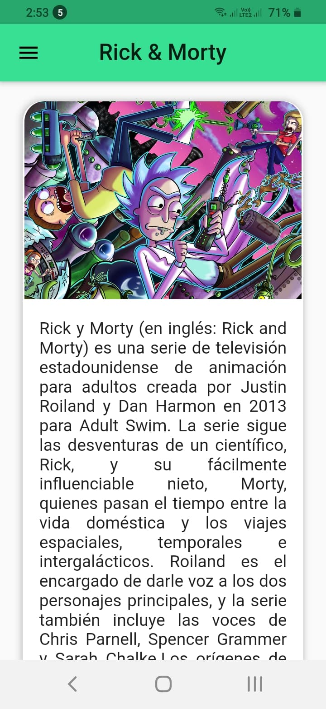
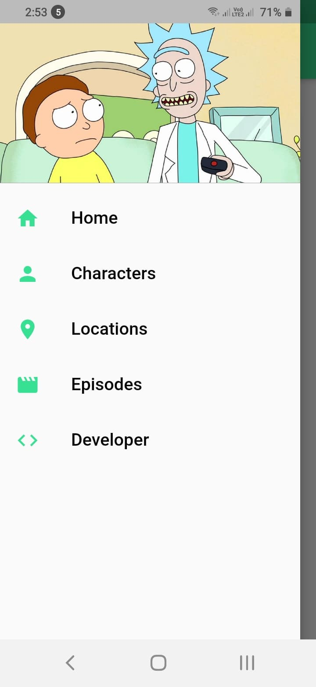
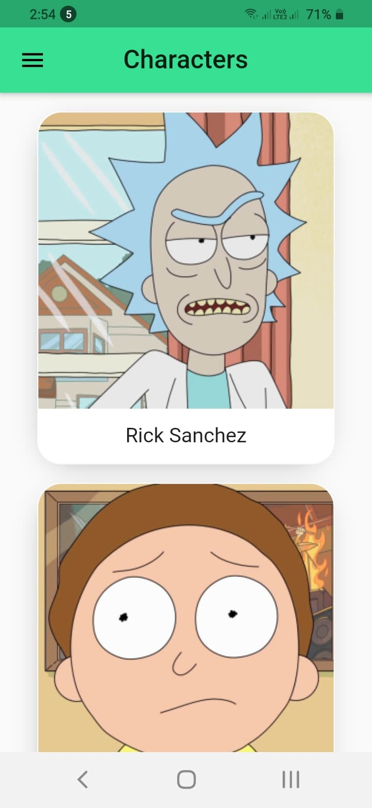
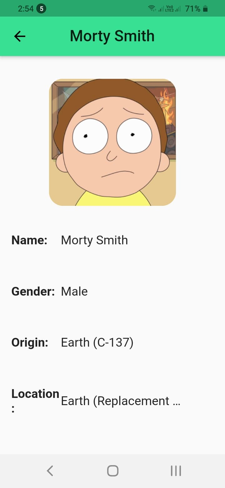
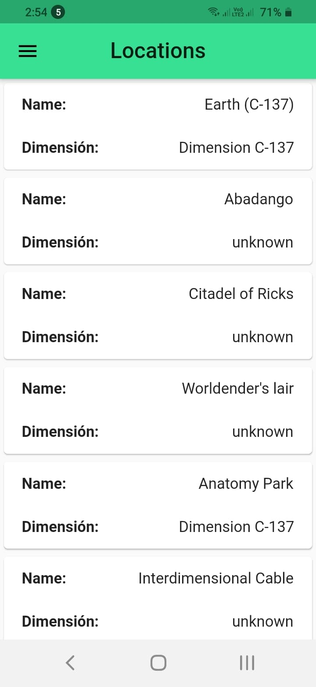
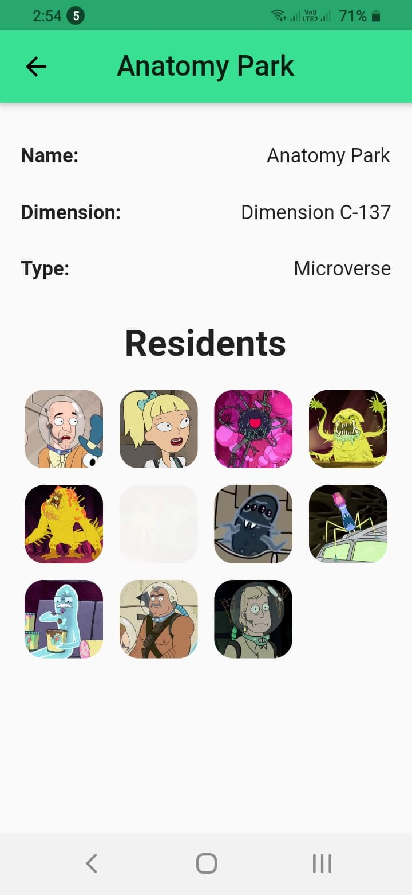
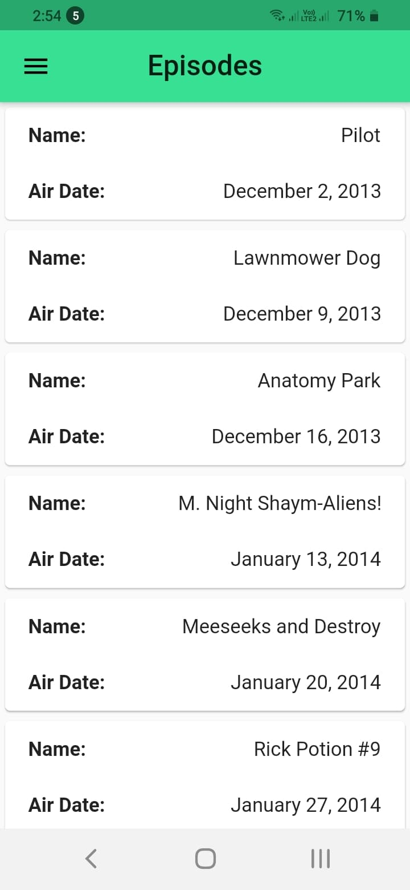
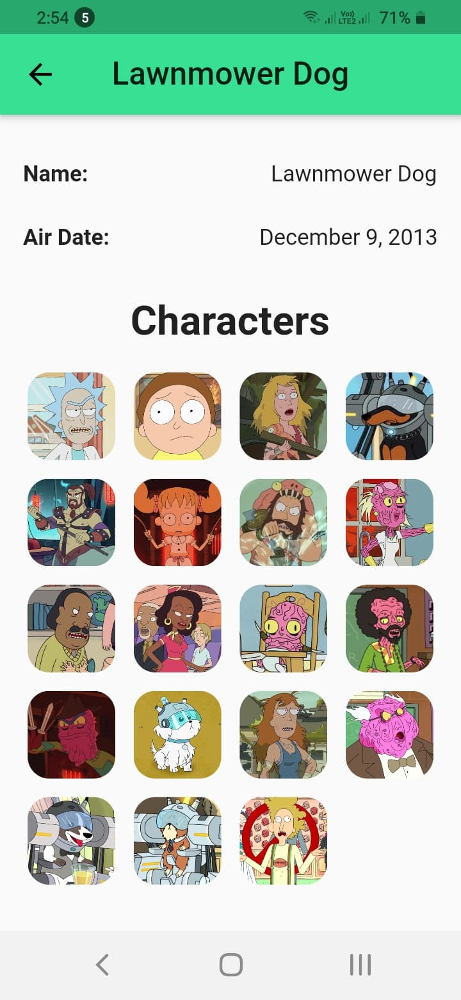

# Rick & Morty APP
 En esta aplicación hecha en Flutter esta consumiendo el [Api de Rick y Morty](https://rickandmortyapi.com/).

 En la aplicación se puede visualizar personajes, lugares y episodios de la serie animada Rick y Morty.

 Consta de 5 pantallas principales y hace uso de algunas animaciones basicas.

 Vamos a ver las pantallas de la aplicación para entender mejor su flujo y funcinamiento.

 ## Pantalla inicial.
 

 ## Drawer Navigator.
 

 ## Pagina de personajes (infinite scroll).
 

 ## Pagina de personaje especifico.
 

 ## Pagina de los lugares(infinite scroll).
 

 ## Pagina de un lugar especifico.
 

 ## Pagina de los diferentes episodios(infinite scroll).
 

 ## Pagina de un episodio especifico.
 

 ## Pagina del desarrollador de la aplicación(enlaces a las diferentes redes).
 

